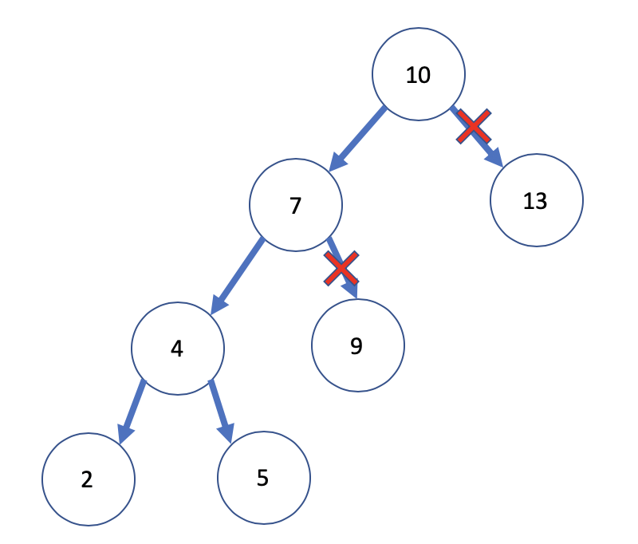

# 완전탐색 Brute Force Search

* 무식하게 푸는방법이 좋은 방법일 때가 있음
* 모든 경우의 수를 나열하면서 답을 찾아가는 방법
* `최적화 문제`에서 많이 사용
* `여러가지 경우`를 만들 수 있을 때 `가장 적합한 답`의 경우를 구하는 문제


## 방법

* for, if를 사용해서 처음부터 끝까지 다 찾기
* 비트마스크
* 순열 O(n!)
* 백트래킹
* BFS
* 재귀


***

### 비트마스크

* 알고리즘보단 문제를 해결하는 테크닉 중 하나
* 코드가 간결
* 작은 메모리와 빠른 수행시간
* 정수의 이진수 표현을 활용한 기법
* 이진수는 0, 1만 가지고 true/false상태를 가짐
* 십진수로 표현 가능
* 쉬프트 연산 사용


10명의 사람중 2,4,6,8 번의 사람만 표현한다면

0101010100으로 표현이 가능하다


{1,2,3,4,5}의 부분집합을 찾을 때

{1,2,3,4} ➡️ 11110 ➡️ 1+2+4+8 = 15 

{2,3,4} ➡️ 01110 ➡️ 2+4+8 = 14

이런식의 표현을 이용


`<<연산` ➡️ *2

`>>연산` ➡️ /2


* 1 << n

  * 원소의 수가 n개인 집합의 부분집합 수

* (1<<n) - 1

  * 모든 부분집합에서 공집합을 뺀 수

  

***

### 순열, 조합

* 중첩루프 or 재귀호출

* 순열

  * O(n!)
  * n개의 원소에서 r개를 골라서 나열하는 방법
  * Permutation
  * P(n, r) = n * (n-1) * (n-2) * ... * (n-k+1)

  ``` swift
  123
  132
  213
  231
  312
  321
  ```

* 조합

  * 서로 다른 n개의 원소에서 순서상관없이 r개를 뽑는 방법
* Combination
  
``` swift
  123 == 132 == 213 == 231 == 312 == 321
```
  
  
  
  

***

### 백트래킹

<div>
  
</div>


* 완전탐색에서 가지치기를 통해서 가도되지않는 루트는 고려하지않고 탐색하는 기법(dfs와 유사)

***

### BFS

* 최단거리
* 분리된 영역의 개수
* 문제에서 요구하는 최적값

***

### 재귀

* 방문체크 이용
* 나열된 원소를 중복허락하지않고 모든경우의수를 구해야할때
  * O(n!)
* 나열된 원소로 만들 수 있는 모든 경우의수 구하기
  * n * n * n * ....
* 종료조건, 예외조건 처리


<br>


### 문제✏️

비트마스크

[1182 부분집합의 합](https://www.acmicpc.net/problem/1182)

순열

[10819 차이를 최대로](https://www.acmicpc.net/problem/10819)

[10971 외판원순회2](https://www.acmicpc.net/problem/10971)

[6603 로또](https://www.acmicpc.net/problem/6603)

완전탐색

[2503 숫자야구](https://www.acmicpc.net/problem/2503)

[2309 일곱난쟁이](https://www.acmicpc.net/problem/2309)

백트래킹

 [9663 N-Queens](https://www.acmicpc.net/problem/9663)

