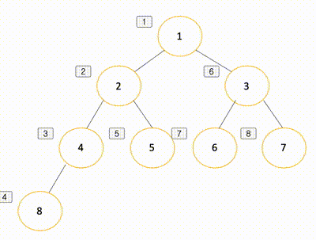
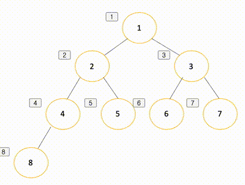

# 완전탐색
말 그대로 가능한 모든 경우의 수를 다 시도해 답을 찾는 방법. 
정확하고 확실하게 답을 찾을 수 있다는 장점이 있지만, 시간이 오래 걸린다는 단점이 있다.


## 깊이 우선 탐색(DFS, Depth-First Search)
루트노드(혹은 다른 임의의 노드)에서 시작해서 다음 분기로 넘어가기 전에 해당 분기를 완벽하게 탐색하는 방법   
쉽게 풀어 말하자면, 탐색에 있어 ```형제 노드 탐색의 우선순위```보다 ```자식 노드 탐색의 우선순위```가 높은 탐색 방법을 뜻한다.  



- 동작방식: 갈 수 있는 만큼 최대한 깊이 가고, 더 이상 갈 곳이 없다면 이전 정점으로 돌아간다.  
- 이러한 DFS를 구현하기 위한 방법으로는  ```재귀```와 ```스택```이 있다.  

#### ☝🏻재귀 함수를 이용한 DFS 풀이
- 인접 행렬을 이용한 구현
```
// DFS - Recursion + 인접 행렬
void dfs_recursion(int x, int y) {
  check[x] = true; 
  for (int i=1; i<=n; i++) {
    if (a[x][i] == 1 && check[i] == false) {
      dfs(i); 
     }
   }
}
```
- 인접 리스트를 이용한 구현
```
void dfs(int x) { 
  check[x] = true; printf("%d ",x);
  for (int i=0; i<a[x].size(); i++) { 
    int y = a[x][i];
    if (check[y] == false) { 
      dfs(y);
    } 
   }
}

```

### ✌🏻Stack을 이용한 DFS 풀이
1. 스택에 시작 노드를 넣는다.
2. 스택이 비어있으면 실행을 멈추고 FALSE를 반환한다.
3. 스택의 맨 위 노드가 찾고자 하는 노드라면, 탐색을 종료하고 TRUE를 반환한다.
4. 3단계에서 스택의 맨 위 노드가 찾고자 하는 노드가 아니라면 해당 노드를 POP한다. 스택에 들어온 적이 없는 POP한 노드의 모든 이웃 노드를 찾아서 순서대로 스택에 넣는다.
```
// DFS - Stack
void dfs_stack(int x, int y) {

    stack< pair<int,int> > s; // 이용할 스택, (x,y) -> (행, 열)
    s.push(make_pair(x,y)); // pair를 만들어서 stack에 넣습니다.

    // 처음 x,y를 방문 했기때문에
    visited[x][y] = true;
    groups[group_id]++;

    while(!s.empty()){

        // 스택의 top 원소 꺼내기
        x = s.top().first;
        y = s.top().second;
        s.pop();

        // 해당 위치의 주변을 확인
        for(int i = 0; i < 4; i++){
            int nx = x + dx[i];
            int ny = y + dy[i];

            // 지도를 벗어나지 않고
            if(0 <= nx && nx < n && 0 <= ny && ny < n){
                // 집이면서 방문하지 않았다면 -> 방문
                if(map[nx][ny] == 1 && visited[nx][ny] == false){
                    visited[nx][ny]=true;

                    // 해당 단지의 집의 수를 증가시킴
                    groups[group_id]++;

                    s.push(make_pair(x,y)); // push하는 경우이기 때문에 현재 위치도 넣어준다.
                    s.push(make_pair(nx,ny)); // 스택에 현재 nx,ny도 푸시
                }
            }
        }   
    }
}
```

### DFS 구현 시 주의해야할 점
- 이러한 DFS를 ```사이클 있는 그래프```탐색에 적용하여 풀이할 때에는, 어떤 노드를 방문했었는지 여부를 반드시 체크해야한다. 검사하지 않을 경우, 무한루프에 빠져  ```런타임 에러```가 발생하게 된다.

### DFS 장점👍🏻
- 찾으려는 노드가 깊은 단계에 있는 경우 BFS 보다 빠르게 찾을 수 있다.
- 현 경로상의 노드를 기억하기 때문에 ```적은 메모리```를 사용한다.

### DFS 단점👎🏻
- 해가 없는 경로를 탐색 할 경우 단계가 끝날 때까지 탐색한다. 
(효율성을 높이기 위해서 미리 지정한 임의 깊이까지만 탐색하고 해를 발견하지 못하면 빠져나와 다른 경로를 탐색하는 방법을 사용한다.)
- DFS를 통해서 얻어진 해가 최단 경로라는 보장이 없다. DFS는 해에 도착하면 탐색을 종료하기 때문이다.


### DFS의 Time Complexity
- DFS는 그래프(정점의 수:N, 간선의 수:E)의 모든 간선을 조회한다.
- 인접 행렬의 경우 ```O(N^2)```, 인접 리스트의 경우 ```O(V+E)```의 시간 복잡도를 가진다.


## BFS
루트 노드(혹은 다른 임의의 노드)에서 시작해서 인접한 노드를 먼저 탐색하는 방법.  
쉽게 풀어 말하자면, 탐색에 있어 ```자식 노드 탐색의 우선순위```보다 ```형제 노드 탐색의 우선순위```가 더 높은 탐색 방법을 뜻한다.  



### Queue을 이용한 BFS 풀이
-인접 행렬을 이용한 풀이
```
queue<int> q;
check[1] = true; q.push(1); 

while (!q.empty()) {
  int x = q.front(); q.pop(); printf("%d ",x);
  for (int i=1; i<=n; i++) {
    if (a[x][i] == 1 && check[i] == false) { 
      check[i] = true;
      q.push(i); 
    }
  } 
}
```
-인접 리스트를 이용한 풀이
```
queue<int> q;
check[1] = true; q.push(1); 

while (!q.empty()) {
  int x = q.front(); 
  q.pop();
  
  for (int i=0; i<a[x].size(); i++) {
    int y = a[x][i];
    if (check[y] == false) {
      check[y] = true; q.push(y); 
     }
   } 
}
```

### 그렇다면 어떤 완전 탐색을 사용할까?
- 깊이 우선 탐색(DFS)이 너비 우선 탐색(BFS)보다 조금 더 간단하다.
- 단순 검색 속도 자체는 너비 우선 탐색(BFS)에 비해 느리다.

